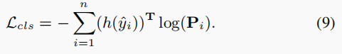

# Weakly Supervised Person Re-ID: Differentiable Graphical Learning and A New Benchmark
代码地址：https://github.com/wanggrun/SYSU-30k

# 概括
- 作者首先爬取了大量的互联网数据（大部分是T台走秀数据），然后将这些数据进行随机截断分为很多小段的视频，得到的就是作者称为弱标注的bag标签。
- 作者提出了一个弱监督的ReID学习方式，这个学习方式利用图模型对于图像的特征以及bag信息和分类器的结果进行建模，优化模型的特征学习能力。

# 动机
目前ReID的研究基本上陷入的瓶颈，最主要的原因是没有像人脸识别一样有一个百万数量级的数据，并且行人重识别的数据集标注难点较多，所以最近几年ReID出现了大量的无监督学习和无监督跨域学习（比较优秀的就是MMT和Spcl）。但是这些方法目前的测试性能离有监督的结果距离还比较大。所以这篇文章的作者就提出了一个基于弱监督学习的方法。如下图所示：
  

通常ReID模型的训练数据如（a）图所示，是非常精细的标签，而本文所提出的方法是一个bag标签，如（b）图所示。这样虽然可以减少人工的标注，但是如果还是按照之前的监督学习方式肯定是不行的，所以作者就提出了如何解决这个问题的一个思路和方法。

# 主要内容
## SYSU-30k数据集
  
SYSU-30k数据集总共包含30,508个身份id（84,930个bag）和29,606,918张行人图片，测试集单独挑选出2198个id进行模型的测试。数据样例如下图所示，  
  
测试方法：
- query：1000个id，1000张图
- gallery：478730张图，但是只有query的1张图查询结果，所以主要计算top1的结果，

测试数据示例： 
  

## WEAKLY SUPERVISED RE-ID MODEL
### 算法流程
- 首先，人的图像被输入DNN的袋子中，获得粗略分类概率；
- 其次，进一步将人图像之间的关系建模为图模型中的成对项，考虑它们在特征和外观上的相似性；
- 第三，最大限度地提高细化的分类概率，并获得了每个图像的伪像级标签
- 第四，使用生成的伪标签来监督深度Re-ID模型的学习

   

### 详细设计
在完全监督的Re-ID中，图像级标签y是已知的。而模型学习的目标是通过最小化图像级别标签和预测之间的损失来学习模型。然而在弱监督ReID中，弱标签l是已知的，但是图像级别的id标签y是未知的，所以为了能够让模型能够训练，设定图片的初始标签id为
  
这里n表示bag的总数，m表示总共id的个数。  

全局损失函数：  
  
每个损失的函数的具体定义：  

P_i 表示DNN对于一张图产生的分类的概率；  

## 实验结果

  
从上面的实验结果可以看出，这篇文章的作者提出的弱监督ReID方法竟然比全监督的方法还要高，不可思议。